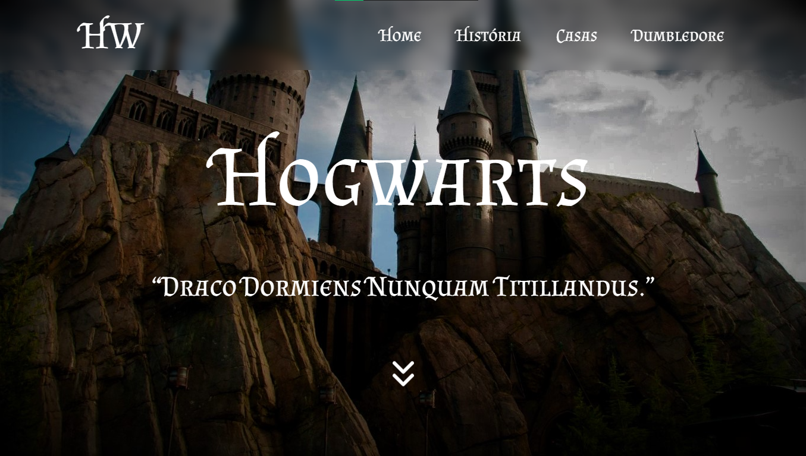
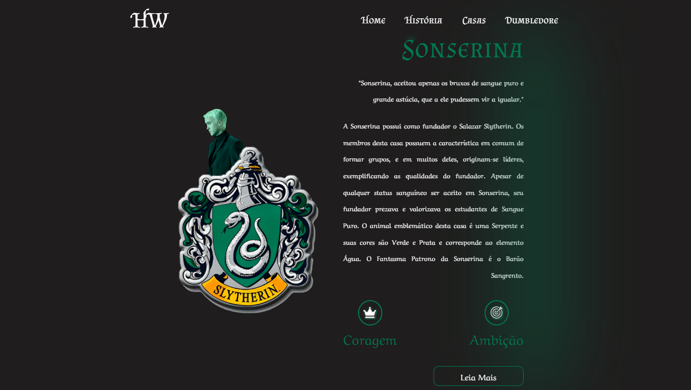
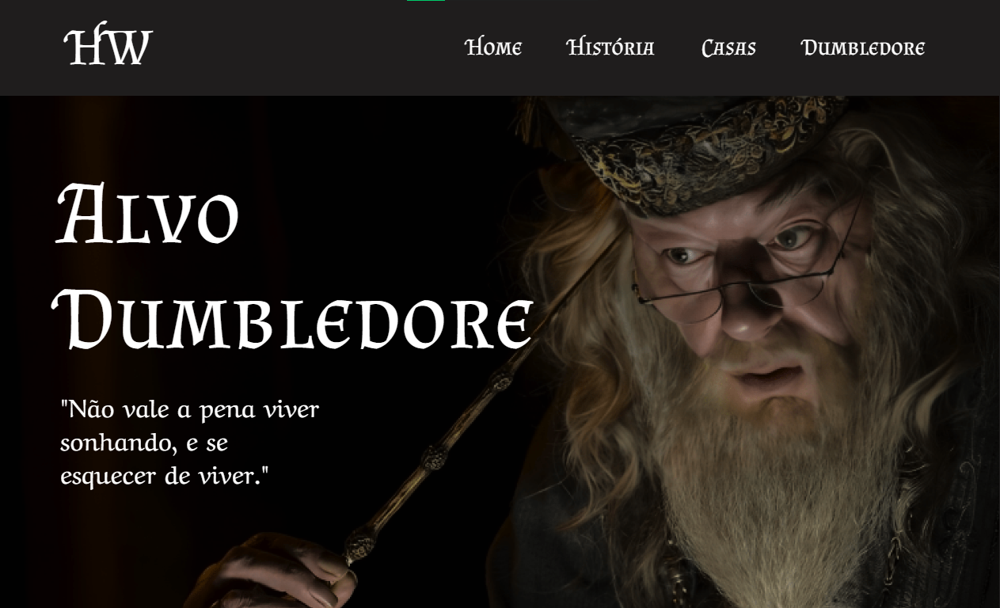

# Hogwarts

## ❓ Sobre

Página ilustrativa sobre Hogwarts, o castelo de Magia e Bruxaria do Universo Mágico de Harry Potter. Apresenta brevemente sua história, as casas, locais e o diretor Alvo Dumbledore.

---

## ⭐ Conceitos e Tecnologias

-   ReactJS;
-   ViteJS;
-   Stitches (CSS-in-JS);
-   TypeScript (TS);
-   Git;
-   Gitmoji;
-   Figma;
-   Commmits semânticos.

---

## 🖥 Visualização

---

---

    <a style="color: #195BBD;" href="https://hogwarts-hp.vercel.app/" target="_blank">Link de Visualização</a>
    
 &copy; Vitor Santos

